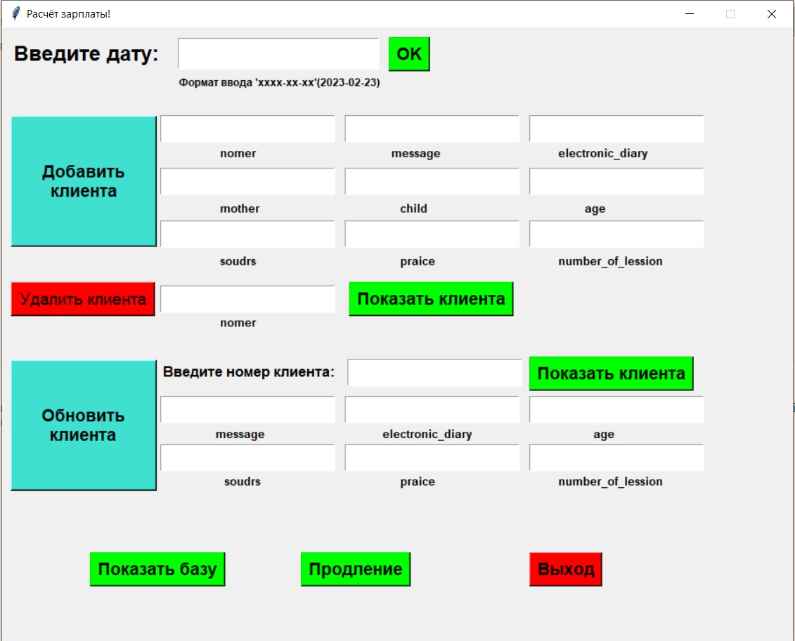
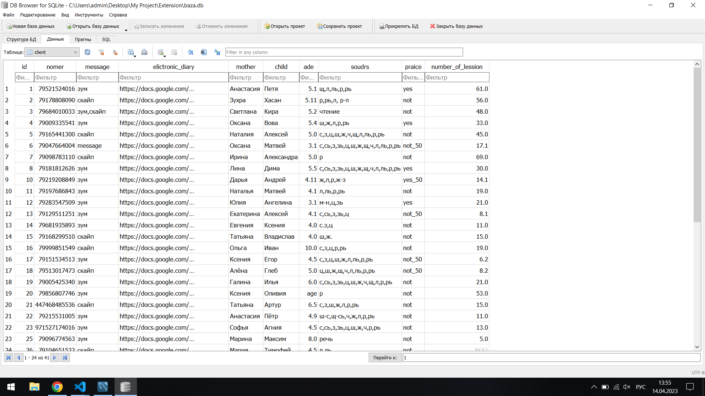
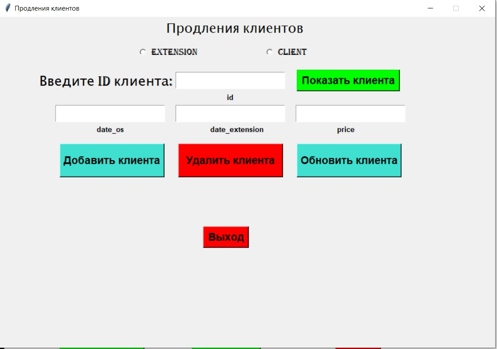

# Программа для расчёта заработной платы
## Программа состоит из:
* __Парсинга данных и запись их в формат JSON__

* __Обработки данных__

* __Вывод данных и их изменение через графический интерфейс__
___
# Принцип работы

_После ввода даты и нажатия на кнопку 'OK' программа автоматически запускает браузер Chrome переходит на сайт вводит логин и пароль. Далее переходит на рабочую неделю введённой даты и собирает данные об клиентах которые были оплачены. Так же программа парсит текущую дату. Все эти данные записываются в формат JSON. Когда программа завершает сбор данных приходит уведомление об успешном сборе данных. Нажав на кнопку 'Показать базу' автоматически открывается 'DB Browser (SQLite)': 
Здесь можно посмотреть результаты расчётов программы а также список текущив клиентов. При нажатии на кнопку продления мы переходим во вкладку с продлениями клиентов и расчёта их: 
Здесь мы можем добавить клиента и произвести расчет его продления._

